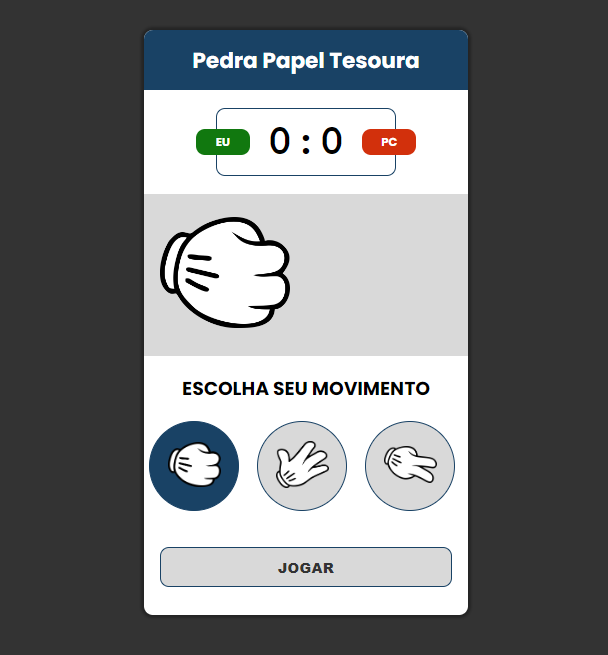

# 📂 JavaScript - Pedra-Papel-Tesoura (Jo-Ken-Pô)

## 📃 Projeto desenvolvido a partir do canal CódigoDev

## 🚀 Tecnologias

- HTML
- CSS
- JavaScript

## 💻 Projeto
> Frontend da aplicação 📸

  

[Acessar o projeto](https://wsawebmaster.github.io/js-jo-ken-po/)

 

---
---
## 📧 Contato
[LinkedIn](https://www.linkedin.com/in/wsawebmaster/)

wsawebmaster@yahoo.com.br
